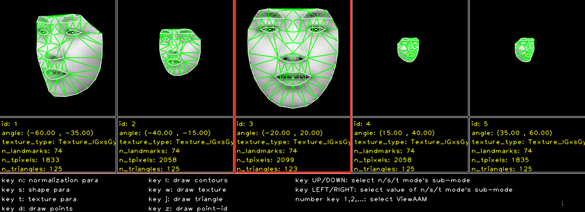

# Multi-View Active Appearance Models #

***coming soon ...***

## References ##

1. T.F. Cootes, and C.J. Taylor,
  "Statistical Models of Appearance for Computer Vision,"
  Online Technical Report, Sept. 2001.
2. Iain Matthews, and Simon Baker,
  "Active Appearance Models Revisited,"
  International Journal of Computer Vision, vol. 60, no. 2, pp. 135-164, 2004.
3. T.F. Cootes, G.V. Wheeler, K.N. Walker, and C.J. Taylor,
  "View-based active appearance models,"
  Image and Vision Computing, vol. 20, no. 9-10, pp. 657-664, 2002.
4. Mingcai Zhou, Yangsheng Wang, Xiaoyan Wang, and Xuetao Feng,
  "A two-stage approach for AAM fitting,"
  8th International Conf. on Intelligent Systems Design and Applications, pp. 257-261, 2008.
5. S. Baker, and I. Matthews,
  "Lucas-Kanade 20 years on: A unifying framework,"
  International Journal of Computer Vision, vol. 56, no. 3, pp. 221-255, 2004.
6. S. Baker, R. Gross, and I. Matthews,
  "Lucas-Kanade 20 years on: A unifying framework: Part 3,"
  Technical Report CMU-RI-TR-03-35, Carnegie Mellon University Robotics Institute, 2003.
7. Ralph Gross, Iain Matthews, and Simon Baker,
  "Active appearance models with occlusion,"
  Image and Vison Computing, vol. 24, no. 6, pp. 593-604, 2006.
8. Mingcai Zhou, Yangsheng Wang, Xuetao Feng, and Xiaoyan  Wang,
  "A Robust Texture Preprocessing for AAM,"
  2008 International Conf. on Computer Science and Software Engineering, pp. 919-922, 2008.
9. Mingcai Zhou, Lin Liang, Jian Sun, and Yangsheng Wang,
  "AAM based face tracking with temporal matching and face segmentation,"
  IEEE Conf. on Computer Vision and Pattern Recognition, pp. 701-708, 2010.

